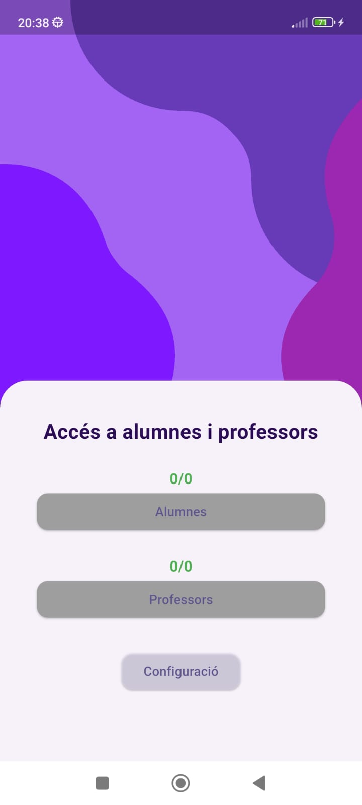
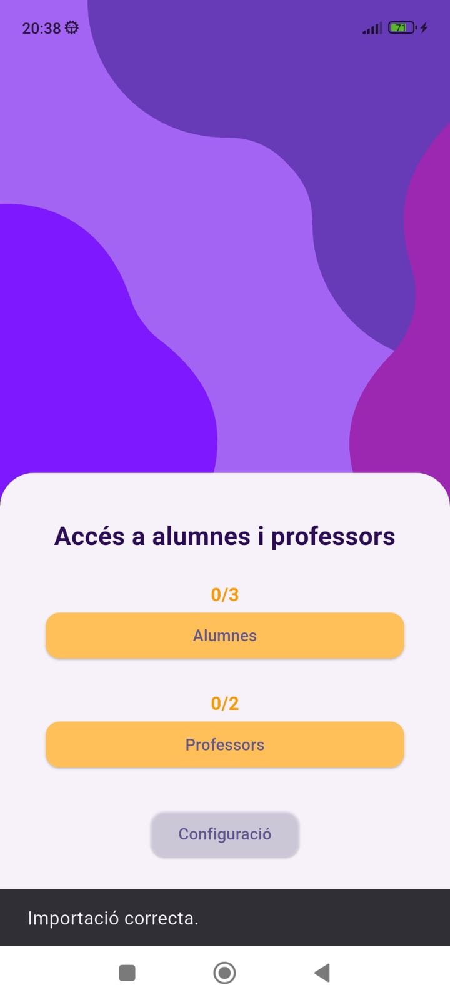
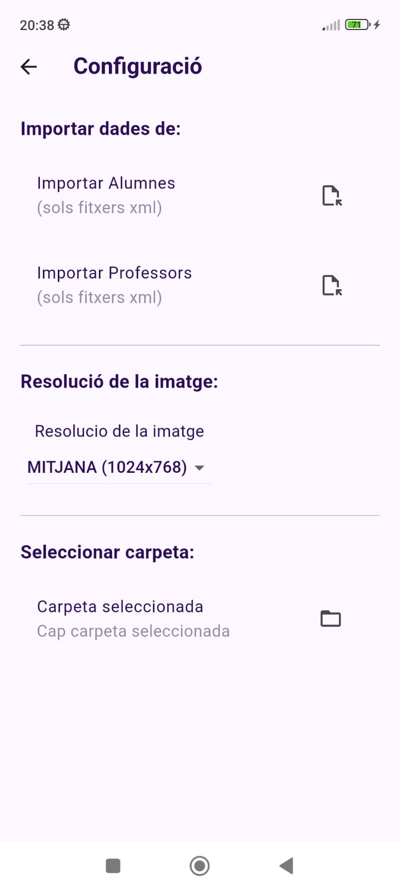
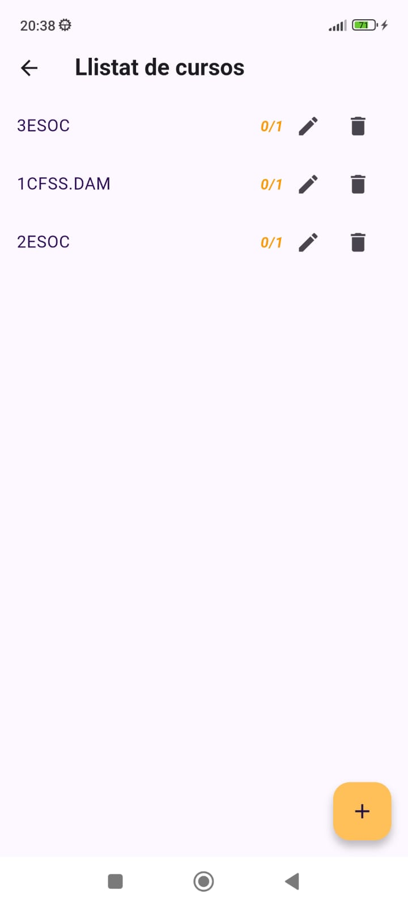
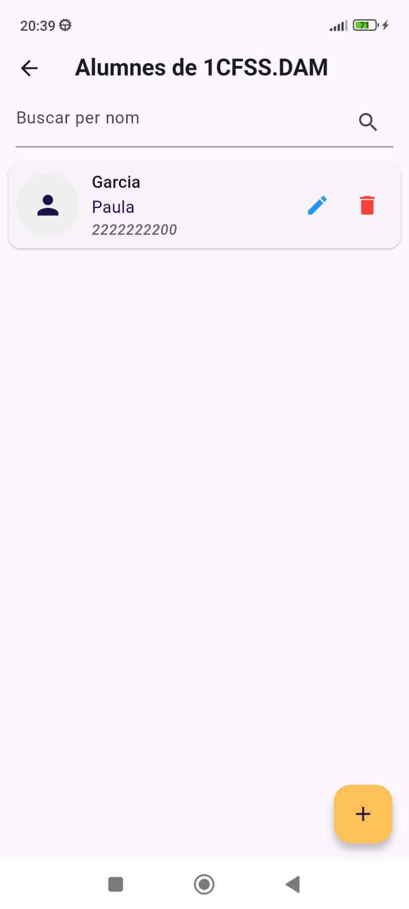

# Classpic

## Descripció
Classpic és una aplicació pensada per gestionar fotografies d'alumnes i professors. Està orientada a gestors de centres educatius, permetent organitzar les fotografies de manera senzilla en carpetes per cursos i usuaris.

## Funcionalitats Principals
- Creació i gestió d'usuaris (alumnes i professors) i dels cursos corresponents.
- Presa de fotografies directament des de l'aplicació.
- Emmagatzematge i organització de fotografies per carpetes.
- Registre d'informació addicional dels usuaris (nom, cognoms, NIA, DNI, etc.).

## Tecnologies Utilitzades
- **Frontend:** Flutter (versió 3.27.4)
- **Base de dades local:** Floor + Floor Generator
- **Gestió d'estat:** Riverpod + Riverpod Generator
- **Càmera i imatge:** Camera, Image Picker, Image Cropper, Flutter Image Compress
- **Animacions:** Lottie, Animated Splash Screen
- **Altres utilitats:** Shared Preferences, Path Provider, Permission Handler

## Estat del Projecte
El projecte es troba actualment en fase **MVP**.

## Requisits previs
- Flutter SDK >= **3.6.2**
- Dart SDK (inclòs amb Flutter)
- Dispositiu amb càmera o emulador amb suport de càmera

## Instal·lació i Execució Local
```bash
# Clonar el repositori
git clone https://github.com/SofiaGracia/classpic.git

# Accedir al projecte
cd classpic

# Instal·lar dependències
flutter pub get

# Executar aplicació
flutter run
```

## Roadmap
- Suport multiidioma

## Captures de pantalla

| Menú inicial | Menú d'importació | Configuració |
|--------------|------------------|--------------|
|  |  |  |

| Cursos | Detall d'usuari |
|--------|-----------------|
|  |  |

# Classpic

## Description
Classpic is an application designed to manage photos of students and teachers.  
It is aimed at school administrators, allowing them to easily organize photos into folders by courses and users.

## Main Features
- Create and manage users (students and teachers) and their corresponding courses.
- Take photos directly from the application.
- Store and organize photos into folders.
- Register additional user information (name, surname, NIA, DNI, etc.).

## Technologies Used
- **Frontend:** Flutter (version 3.27.4)
- **Local database:** Floor + Floor Generator
- **State management:** Riverpod + Riverpod Generator
- **Camera and image:** Camera, Image Picker, Image Cropper, Flutter Image Compress
- **Animations:** Lottie, Animated Splash Screen
- **Other utilities:** Shared Preferences, Path Provider, Permission Handler

## Project Status
The project is currently in the **MVP** phase.

## Prerequisites
- Flutter SDK >= **3.6.2**
- Dart SDK (included with Flutter)
- Device with a camera or emulator with camera support

## Installation & Local Execution
```bash
# Clone the repository
git clone https://github.com/SofiaGracia/classpic.git

# Go to the project folder
cd classpic

# Install dependencies
flutter pub get

# Run the app
flutter run
```
## Roadmap
- Multi-language support

## Screenshots

| Menú inicial | Menú d'importació | Configuració |
|--------------|------------------|--------------|
|  |  |  |

| Cursos | Detall d'usuari |
|--------|-----------------|
|  |  |
